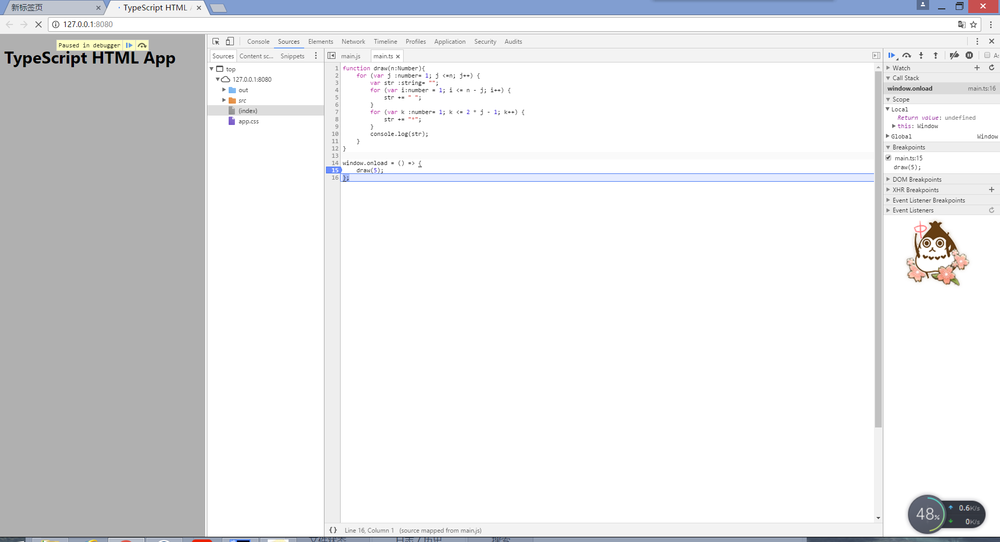

# WebProject

###下面是src中的main.ts代码： 

```java
function draw(n:Number){
    for (var j :number= 1; j <=n; j++) {
        var str :string= "";
        for (var i:number = 1; i <= n - j; i++) {
            str += " ";
        }
        for (var k :number= 1; k <= 2 * j - 1; k++) {
            str += "*";
        }
        console.log(str);
    }
}

window.onload = () => {
    draw(5);
};
```
###下面是截图： 
（1）打断点 

（2）单步跳入 

（3）第一个for

（4）第二个for

（5）单步跳出

